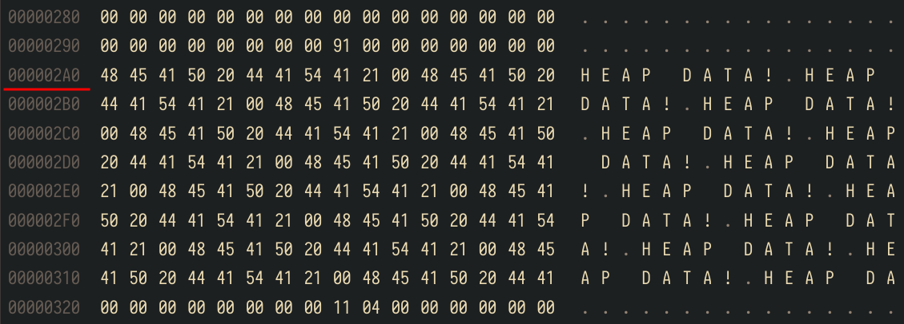
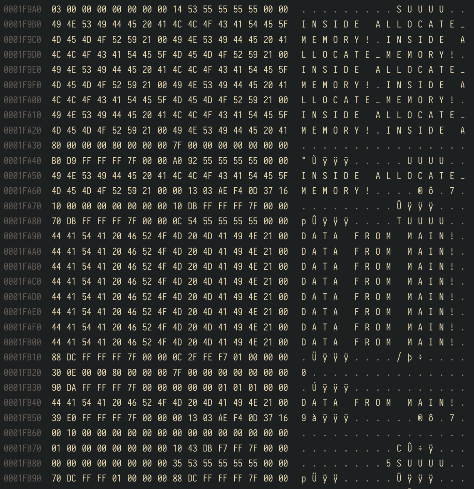

Example of linux process memory management and virtual memory.  
Created for a course at Blekinge Institute of Technology.

## Purpose
The purpose of this example is to provide insight into virtual memory and
pointers.

Using only GDB it is possible to dump a process' virtual memory and to visualize
the memory layout of a process to give a concrete example of the classic diagram
below.

```
┌─────────────────────┐
│Command line args and│
│environment variables│
├─────────────────────┤
│        Stack        │
│          │          │
│          │          │
│          ▼          │ Grows downwards
├ ─ ─ ─ ─ ─ ─ ─ ─ ─ ─ ┤ 
│                     │
│                     │
│                     │
├ ─ ─ ─ ─ ─ ─ ─ ─ ─ ─ ┤
│          ▲          │
│          │          │ Grows upwards
│          │          │
│        Heap         │
├─────────────────────┤
│        BSS          │
├─────────────────────┤
│        DATA         │
├─────────────────────┤
│        TEXT         │
└─────────────────────┘
```

## Usage
Place a breakpoint on line 28 to stop execution at a point when the programme is
inside a function with some local data and after some dynamic memory has been
allocated and filled.

Execute `info proc mappings` in GDB or `-exec info proc mappings` if using
GDB through vscode. The output will look something like:

```
process 6283
Mapped address spaces:

          Start Addr           End Addr       Size     Offset objfile
      0x555555554000     0x555555555000     0x1000        0x0 /home/david/dev/cpp/repos/memoryexplore/main
      0x555555555000     0x555555556000     0x1000     0x1000 /home/david/dev/cpp/repos/memoryexplore/main
      0x555555556000     0x555555557000     0x1000     0x2000 /home/david/dev/cpp/repos/memoryexplore/main
      0x555555557000     0x555555558000     0x1000     0x2000 /home/david/dev/cpp/repos/memoryexplore/main
      0x555555558000     0x555555559000     0x1000     0x3000 /home/david/dev/cpp/repos/memoryexplore/main
      0x555555559000     0x55555557a000    0x21000        0x0 [heap]
      0x7ffff7d84000     0x7ffff7d87000     0x3000        0x0 
      0x7ffff7d87000     0x7ffff7db3000    0x2c000        0x0 /usr/lib/libc.so.6
      0x7ffff7db3000     0x7ffff7f29000   0x176000    0x2c000 /usr/lib/libc.so.6
      0x7ffff7f29000     0x7ffff7f7d000    0x54000   0x1a2000 /usr/lib/libc.so.6
      0x7ffff7f7d000     0x7ffff7f7e000     0x1000   0x1f6000 /usr/lib/libc.so.6
      0x7ffff7f7e000     0x7ffff7f81000     0x3000   0x1f6000 /usr/lib/libc.so.6
      0x7ffff7f81000     0x7ffff7f84000     0x3000   0x1f9000 /usr/lib/libc.so.6
      0x7ffff7f84000     0x7ffff7f93000     0xf000        0x0 
      0x7ffff7fc0000     0x7ffff7fc4000     0x4000        0x0 [vvar]
      0x7ffff7fc4000     0x7ffff7fc6000     0x2000        0x0 [vdso]
      0x7ffff7fc6000     0x7ffff7fc8000     0x2000        0x0 /usr/lib/ld-linux-x86-64.so.2
      0x7ffff7fc8000     0x7ffff7fef000    0x27000     0x2000 /usr/lib/ld-linux-x86-64.so.2
      0x7ffff7fef000     0x7ffff7ffa000     0xb000    0x29000 /usr/lib/ld-linux-x86-64.so.2
      0x7ffff7ffb000     0x7ffff7ffd000     0x2000    0x34000 /usr/lib/ld-linux-x86-64.so.2
      0x7ffff7ffd000     0x7ffff7fff000     0x2000    0x36000 /usr/lib/ld-linux-x86-64.so.2
      0x7ffffffde000     0x7ffffffff000    0x21000        0x0 [stack]
  0xffffffffff600000 0xffffffffff601000     0x1000        0x0 [vsyscall]
```

The following commands can then be executed to dump pieces of virtual memory to
a file:
```
dump memory heap 0x555555559000 0x55555557a000
dump memory proc 0x555555554000 0x555555559000
dump memory stack 0x7ffffffde000 0x7ffffffff000
```

Using the output from the currently running programme execution, the exact heap
offset of the dynamically allocated memory can be found:
```
Address of allocated memory: 0x5555555592a0

print /x 0x5555555592a0 - 0x555555559000
$1 = 0x2a0
```



`argc`, `argv`, and environment variables can be found in the end of the stack
file, as expected.

Local variables can be found inside the stack file

